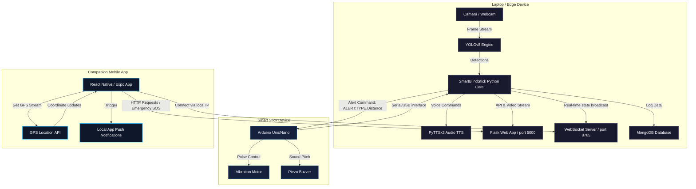

# 🦯 Smart Blind Stick System

An advanced, multi-modal assistive IoT system designed to empower visually impaired individuals with safer, more autonomous navigation. The system combines real-time Edge AI object detection, speech feedback, physical haptic/sound alerts, a local web dashboard control panel, and a companion Expo/React Native mobile app with real-time GPS sharing and emergency SOS broadcasting.

---

## 📐 System Architecture

The project is structured into three primary interacting layers: the **Edge AI & Web Server**, the **Arduino Hardware Stick**, and the **React Native Companion Mobile App**.



---

## ✨ Key Features

1. **Edge AI Computer Vision (`YOLOv8`)**: 
   - Utilizes `yolov8n.pt` to detect persons, vehicles (cars, trucks, buses, motorcycles), bicycles, and stop signs in real-time.
   - Calculates relative distance and direction indicators (left, center, right) based on bounding box proportions.
2. **Interactive Web Dashboard**:
   - Built-in Flask site hosted locally for caretakers or testing.
   - Streams live camera feeds with overlay detection boxes.
   - Displays real-time device health, active warning lists, statistics, and location updates on Google Maps.
3. **Reactive Physical Feedback (Arduino)**:
   - Serial port scanning and auto-reconnection loop.
   - Dynamic buzzer and vibration intensities triggered when obstacles get too close (`<100cm`).
4. **Text-To-Speech (TTS) Navigation**:
   - Vocal warnings (e.g., *"Person center, close!"*) using Python's `pyttsx3`.
   - Customized cooldown intervals per class to prevent auditory overload.
5. **Expo React Native Companion Mobile App**:
   - Simple-to-configure connection using local IP networking.
   - Vibration cues (`Vibration` API) and warning sounds (`expo-av`).
   - Constant background GPS scanning (`expo-location`) to keep trackers updated on user positioning.
   - Push notifications alerts on danger state changes.
6. **Automatic SOS / Emergency Mode**:
   - Double-trigger support (physical button or mobile dashboard).
   - Instantly speaks distress messages, overrides hardware alerts, broadcasts current GPS location to the control panel, and displays Google Maps navigation coordinates.
7. **Analytics Logging (MongoDB)**:
   - Event histories for system start times, object frequencies, distance warnings, and emergency situations are indexed.
   - **Software-only mode**: Gracefully runs without database logs if MongoDB is offline.

---

## 🛠️ Prerequisites & Hardware Setup

### Hardware Components
* **Computing Node**: Laptop/PC or Raspberry Pi with a webcam/camera.
* **Arduino Board**: Arduino Uno, Nano, or Mega.
* **Actuators**: 
  - 5V Vibration Motor (or haptic disc).
  - 5V Active Piezo Buzzer.
* **Sensors (Optional)**: Ultrasonic/Infrared distance sensors connected to Arduino.
* **Android/iOS Device**: For running the companion mobile application.

### Wiring Configuration
| Component | Arduino Pin | Description |
| :--- | :--- | :--- |
| **Vibration Motor (+)** | Pin 10 (PWM recommended) | Haptic warning feedback |
| **Active Buzzer (+)** | Pin 9 | Audible warning feedback |
| **GND (-)** | GND | Common ground connection |

---

## 📥 Installation & Build Guide

### Step 1: Clone the Project
Navigate to your workspace directory and verify project files:
```bash
cd "PROJECT SEM 4/blind stick"
```

### Step 2: Install Python Libraries
Install the necessary requirements for the Edge computing server:
```bash
pip install -r requirements.txt
```
> [!NOTE]
> System packages `libgl1-mesa-glx` and `libglib2.0-0` are required for OpenCV execution on Linux environments.

### Step 3: Run MongoDB Local Service
Ensure MongoDB is running locally on port `27017` to enable telemetry logging:
* **Windows**: Start the service via `services.msc` or run `net start MongoDB`.
* **Linux/macOS**: Run `sudo systemctl start mongod`.

---

## 📟 Arduino Firmware Setup

Load the following sketch onto your Arduino board using the Arduino IDE. This sketch processes incoming serial commands from the Python runtime:

```cpp
/**
 * Smart Blind Stick - Actuator Driver Sketch
 * Listens for commands on serial port and outputs hardware alerts.
 */

const int buzzerPin = 9;
const int vibrationPin = 10;

void setup() {
  Serial.begin(9600);
  pinMode(buzzerPin, OUTPUT);
  pinMode(vibrationPin, OUTPUT);
  
  // Handshake signal to python on start/reset
  Serial.println("READY");
}

void loop() {
  if (Serial.available() > 0) {
    String command = Serial.readStringUntil('\n');
    command.trim();
    
    if (command.startsWith("ALERT:")) {
      // Format example: "ALERT:PERSON,30" or "ALERT:VEHICLE,60"
      int commaIndex = command.indexOf(',');
      if (commaIndex != -1) {
        String alertType = command.substring(6, commaIndex);
        int distance = command.substring(commaIndex + 1).toInt();
        triggerAlert(alertType, distance);
      }
    } 
    else if (command == "STOP") {
      stopAlerts();
    } 
    else if (command == "TEST") {
      testHardware();
    } 
    else if (command == "STATUS") {
      Serial.println("ALIVE"); // Keepalive response
    }
  }
}

void triggerAlert(String type, int distance) {
  // Speed up pulsing speed for closer obstacles (range 10cm to 100cm)
  int pulseDelay = map(constrain(distance, 10, 100), 10, 100, 50, 400);
  
  digitalWrite(vibrationPin, HIGH);
  if (type == "PERSON" || type == "EMERGENCY" || type == "VEHICLE") {
    digitalWrite(buzzerPin, HIGH);
  }
  
  delay(100);
  digitalWrite(vibrationPin, LOW);
  digitalWrite(buzzerPin, LOW);
  delay(pulseDelay);
}

void stopAlerts() {
  digitalWrite(buzzerPin, LOW);
  digitalWrite(vibrationPin, LOW);
}

void testHardware() {
  digitalWrite(buzzerPin, HIGH);
  digitalWrite(vibrationPin, HIGH);
  delay(500);
  stopAlerts();
}
```

---

## 📱 Mobile Companion App Setup

1. Make sure you have Node.js installed.
2. Enter the mobile application directory:
   ```bash
   cd mobile_app
   ```
3. Install dependencies:
   ```bash
   npm install
   ```
4. Place an alert audio asset (mp3) named `alert.mp3` inside the assets directory (`mobile_app/assets/alert.mp3`).
5. Launch the Expo bundler:
   ```bash
   npx expo start
   ```
6. Scan the QR code displayed in the terminal using the Expo Go app (Android) or Camera app (iOS).

---

## 🚀 Execution & Running the Server

Start the core backend server by executing:
```bash
python blind_stick.py
```

Upon starting, the script performs the following diagnostics:
* Scans and establishes connection with the Arduino board.
* Initializes the `pyttsx3` Voice Engine.
* Loads the YOLO weight parameters.
* Validates webcam availability.
* Tests MongoDB server availability.

### Network Services
Once loaded, the terminal displays access URLs for clients:
* **Web UI Control Panel**: `http://localhost:5000` (Open in laptop browser)
* **Mobile WS Socket**: `ws://<your-local-ip>:8765` (Connects the React Native app)
* **Mobile HTTP API**: `http://<your-local-ip>:5000` (Emergency triggers)

---

## 🗃️ Codebase Directory structure

```
.
├── blind_stick.py          # Primary Flask + WS application server (Includes Arduino & DB controllers)
├── blind_stick_app.py      # Base application server module (without reconnect enhancements)
├── requirements.txt        # Full checklist of python framework libraries
├── packages.txt            # System dependencies for deployment
├── yolov8n.pt              # YOLOv8 pre-trained weights
├── mobile_app/
│   ├── App.js              # Expo React Native App UI with GPS & web socket clients
│   └── package.json        # Node.js project settings and expo bundles
└── README.md               # Project documentation
```

---

## ⚙️ Communication Protocols (Serial/Sockets)

### Serial API (Edge Server -> Arduino)
* `ALERT:<TYPE>,<DISTANCE_CM>\n`: Triggers haptic warnings (e.g. `ALERT:PERSON,30`).
* `STOP\n`: Instantly silences buzzer and vibration.
* `TEST\n`: Pulses all connected feedback actuators for diagnostical testing.
* `STATUS\n`: Requests client heartbeat.

### WebSocket payload structure
The server broadcasts a state update payload JSON every 100ms:
```json
{
  "detections": [
    {
      "class": "person",
      "confidence": 0.89,
      "distance": "close",
      "distance_cm": 60,
      "direction": "center",
      "bbox": [120, 80, 340, 420]
    }
  ],
  "person_count": 1,
  "vehicle_count": 0,
  "fps": 28,
  "emergency": false,
  "location": {
    "lat": 11.2745,
    "lng": 77.5831,
    "address": "Perundurai, Tamil Nadu, India"
  },
  "arduino_connected": true
}
```
